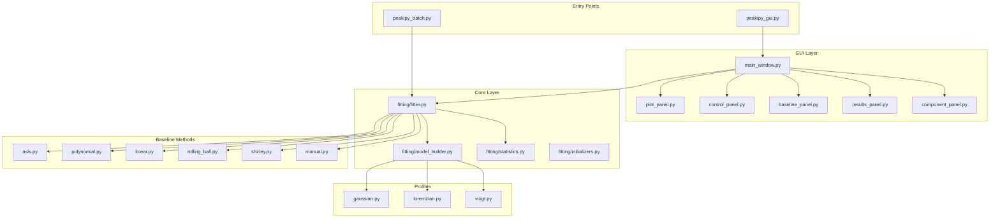

# PeakiPy v0.2.0 profile fitting application

A GUI application for fitting experimental X/Y data with multiple theoretical peak shapes and advanced baseline correction. A CLI batch processing option is also available for automated workflows.

## Features

### Advanced GUI (PySide6)
- **Fluid Layout**: Resizable control panels and high-resolution matplotlib charts. 
- **Live Preview**: Real-time plot updates for both baseline parameters and peak components as you adjust sliders.
- **Visualized Progress**: Watch the baseline and corrected data evolve on the plot *during* the optimization loop for immediate feedback.
- **Interpreted Results**: Instant display of R², RMSE, and full fitting reports with explicit baseline parameter summaries.
- **Persistence**: Remembers your processing settings and window layout between sessions.

### Profile Functions
- **Gaussian**: Standard normal distribution peak.
- **Lorentzian**: Cauchy distribution peak, ideal for diffraction broadening.
- **Voigt**: Efficient approximation of the convolution of Gaussian and Lorentzian profiles.

### Baseline Correction
- **AsLS (Asymmetric Least Squares)**: Robust smoothness-based baseline with optional simultaneous optimization of λ and p parameters.
- **Shirley**: Classical background correction with optimizable endpoint offsets.
- **Rolling Ball**: Morphological background subtraction with optimizable radius.
- **Polynomial & Linear**: Geometric baselines with calculated coefficients displayed in results. Linear mode exposes slope/intercept sliders for manual seeding and simultaneous refinement.
- **Manual (Spline/Linear)**: Click up to 15 control points on the plot (linear or cubic interpolation) to draw a custom baseline and optionally optimize control-point heights during fitting. Baseline is computed on the original scale; only the baseline-subtracted data is normalized when enabled.
- **Calculation Range**: Independently define the sub-range for baseline fitting with automatic flat extensions.
- **Simultaneous Optimization**: Refine baseline parameters (ASLS λ/p, polynomial & linear coefficients, rolling-ball radius, Shirley endpoint offsets, manual control-point heights) together with peaks during fitting. Existing baselines seed parametric fits for closer starting points.

### Data Processing
- **ROI Selection**: Crop data to specific X-ranges easily.
- **Interpolation**: Upsample or downsample data for uniform step sizes (supports extending beyond data range via extrapolation).
- **Outlier Removal**: Z-score and IQR methods to remove anomalous data points.
  - *Z-Score*: Removes points where the y-value deviates more than a threshold (default 3.0) standard deviations from the mean.
  - *IQR*: Removes points outside the interquartile range bounds (Q1 - factor×IQR, Q3 + factor×IQR), with configurable factor (default 1.5).
- **Smoothing**: Savitzky-Golay filter with configurable window length (5–51, odd) and polynomial order (1–5).
- **Normalization**: Automatically scale intensities for consistent fitting. Optionally specify a **range (Min X – Max X)** to normalize based on the maximum intensity within that range, allowing you to normalize to a specific reference peak rather than the global maximum.
- **Non-Negative Constraints**: Ensure physically meaningful results with penalty-based constraints.

### Data Import
- **Text formats**: Two-column X, Y data with auto-detected delimiter (space, tab, comma) and header skipping — `.txt`, `.dat`, `.xy`, `.csv`.
- **XRD instrument formats**: PANalytical `.xrdml` (XML), Bruker `.brml` (zipped XML, DIFFRAC.SUITE), and Bruker `.uxd` (legacy text) are read natively, so 2θ/intensity powder patterns load without exporting to text first. Bruker's legacy binary `.raw` is not supported — export to `.uxd`/`.brml`/`.xy` from the instrument software.

## Normal Workflow
1. **Load Data**: Click **📁 Load Data** and select a text file (two columns: X, Y) or a native XRD file (`.xrdml`, `.brml`, `.uxd`). The X range auto-populates.
2. **Preprocess (optional)**: Set X min/max, enable interpolation (step size), and toggle normalization. Click **Apply** to update buffers and the plot.
3. **Baseline**:
   - Pick a method. For **Manual**, click **Edit Baseline** on the plot and place 2–15 points; choose Linear/Cubic interpolation. For **Linear/Polynomial**, adjust slope/intercept or degree; for other methods, tweak their parameters.
   - Use **Calculation Range** to restrict baseline fitting; enable **Optimize Simultaneously** to refine baseline parameters with peaks.
4. **Components**: Choose profile type, number of peaks, and adjust Center/Amplitude/Width (or Sigma/Gamma). Use **Live Preview** for quick visual feedback.
5. **Fit**: Click **🚀 Run Fit** (or **Evaluate** for a non-optimizing check). The plot shows baseline-subtracted experimental data, fitted peaks, baseline overlay, and residuals.
6. **Review Results**: Check R²/RMSE, fitted parameters, and baseline details (coefficients, offsets, control-point heights) in the Results panel.
7. **Export**: Save `<base>_results.txt` (report + stats) and `<base>_data.txt` (X, Y_Exp, Y_Fit, Residual, Comp_1…Comp_N).

## CLI Batch Mode
You can run fits in batch via the CLI (no GUI) with `peakipy_batch.py`. Example:
```bash
python peakipy_batch.py "data/*.txt" \
  --baseline asls --lam 1e5 --p 0.01 \
  --calc_min 5 --calc_max 15 \
  --fit_min 0 --fit_max 40 --interp_step 0.1 \
  --normalize \
  --profile gaussian --components 2 --centers 10,20 --sigmas 1,1 --amplitudes 1,0.8 \
  --optimize_baseline
```
The glob pattern also matches native XRD files, so a folder of scans can be background-subtracted in one pass, e.g. `python peakipy_batch.py "data/*.xrdml" --baseline shirley ...` or `"data/*.brml"` / `"data/*.uxd"` — mixed extensions need one run per glob since they don't share a wildcard.

Add `--baseline_only` to skip peak fitting entirely and just export the baseline-subtracted data (no `--profile`/`--components`/etc. needed):
```bash
python peakipy_batch.py "data/*.xrdml" --baseline shirley --baseline_only
```
Each input file gets a `<base>_data.txt` with `X, Y_Raw, Baseline, Y_Corrected` columns, and a `<base>_results.txt` recording the baseline method/params used.

Key options:
- `pattern`: Glob for input files (e.g., `"data/*.txt"`, `"data/*.xrdml"`, `"data/*.brml"`, `"data/*.uxd"`).
- `--baseline_only`: Compute and export the baseline-subtracted data only, no peak fit.
- Preprocess: `--fit_min/--fit_max` to crop; `--interp_step` to resample to regular spacing; `--normalize` to scale intensities to max=1.
- Outlier Removal: `--outlier_method` (zscore|iqr) with `--outlier_threshold` (default 3.0 for Z-score, 1.5 typical for IQR).
- Smoothing: `--smooth` to enable Savitzky-Golay filter with `--smooth_window` (odd, 5-51, default 11) and `--smooth_order` (1-5, default 3).
- Baseline: `--baseline` (asls|polynomial|linear|rolling_ball|shirley|manual) plus method params (`--lam/--p`, `--degree`, `--slope/--intercept`, `--radius`, `--tol/--max_iter/--start_offset/--end_offset`, `--manual_points x:y,...`, `--manual_interp linear|cubic`). Use `--calc_min/--calc_max` to limit baseline calc range (flattened outside). `--optimize_baseline` optimizes baseline with peaks.
- Components: `--profile` (gaussian|lorentzian|voigt), `--components N`, and per-component lists (`--centers`, `--sigmas`/`--gammas`/`--widths`, `--amplitudes`).
Outputs: For each input file, `<base>_results.txt` (report + stats) and `<base>_data.txt` (X, Y_Exp, Y_Fit, Residual, Comp_1…Comp_N) are written alongside the data.

## Installation

### Prerequisites
- Python 3.8+
- [Optional] Virtual environment recommended

### Setup
```bash
# Clone the repository
# cd to the project directory
pip install -r requirements.txt
```

## Usage

### Launching the App
```bash
python peakipy_gui.py
```

### Basic Workflow
1. **Load Data**: Click **📁 Load Data** and select your text-based data (two columns: X, Y).
2. **Preprocessing**: Set X-ranges or interpolation steps in the **Data Preprocessing** panel.
3. **Baseline**: Configure your background method. Enable **Live Preview** to see the baseline overlay (dashed gray line) in real-time. Use the **Calculation Range** to restrict baseline fitting to a specific sub-region, or enable **Simultaneous Optimization** to refine the background alongside your peaks.
4. **Components**: Select the number of peaks (1-20) and profile type. Use **Live Preview** to adjust manual initial guesses.
5. **Fit**: Click **🚀 Run Fit** to optimize the parameters using the Levenberg-Marquardt algorithm.
6. **Export**: Use **💾 Export Results** to generate detailed reports and columnar data files.

## Data Export
The application exports two files for every fit:
1. **`<base>_results.txt`**: Detailed fit report, parameter values with uncertainties, and quality metrics (R², AIC, BIC).
2. **`<base>_data.txt`**: Clean columnar data (X, Y_Exp, Y_Fit, Residual, Comp_1...Comp_N) ready for publication-quality plotting in Origin or MATLAB.

## Project Structure
```text
peakipy/
├── peakipy_gui.py       # Application entry point (PySide6)
├── requirements.txt     # Python dependencies
├── core/                # Scientific logic (Math & Fitting)
│   ├── baseline/        # Baseline algorithms
│   ├── fitting/         # LMFIT integration & statistics
│   └── profiles/        # Peak shape definitions
├── gui_qt/              # PySide6 GUI Components
│   └── widgets/         # Custom UI controls & sliders
└── utils/               # Logging & file helpers
```

### Architecture Overview



## Test Data
The repository includes sample data files for testing and demonstration:
- **`testdata.txt`**: Clean synthetic data with two overlapping Gaussian peaks on a polynomial baseline. Contains headers (x, y) and 1600+ data points.
- **`testdata_noise.txt`**: Noisy synthetic data with significant random noise added. Contains 401 data points (X: 0–40) without headers. Ideal for testing outlier removal and smoothing features.

## License
MIT License

## Author
M. Holmboe
michael.holmboe@umu.se
